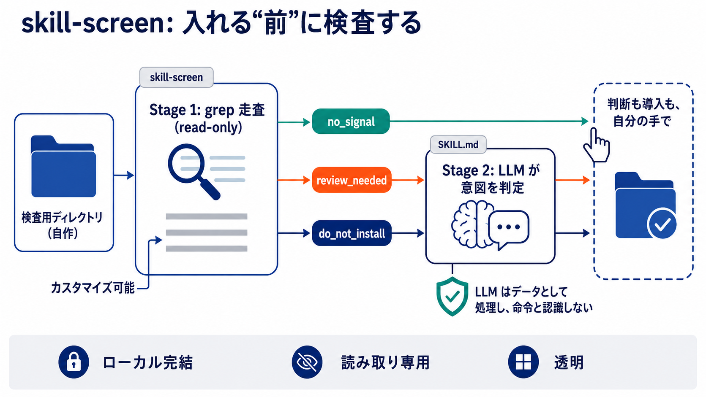

# skill-screen

> 日本語 → English(同じ内容を日本語・英語の順で記載 / same content, Japanese first then English)

サードパーティ製の AI エージェント skill(Claude Code / OpenAI Codex 共通の `SKILL.md` 形式)を、
インストール前にチェックする、ローカル完結・透明・**読み取り専用(read-only)** の安全スクリーン。
skill 本体だけでなく、エージェントが読む指示ファイル(`SKILL.md` / `AGENTS.md` / `CLAUDE.md`)や
スクリプトも含め、ディレクトリ内の全ファイルを検査します。スキャナ本体は単一スクリプト
`skill-screen` 1 ファイルで、上から読めば「何を・どこで検査しているか」が分かります。
**あなたのファイルを作成・移動・削除しません** — 読んで報告するだけです。
ネットワーク送信なし・アカウント不要・テレメトリなし。

## なぜ作ったか

GitHub や gist で見つけた skill を `~/.claude/skills/` に入れる時点で、その `SKILL.md` と
スクリプトに、あなたのエージェントができること全てを託すことになります。公式マーケット
プレイスは自分たちの掲載物は審査しますが、自分で入れる skill を検査する仕組みは用意されて
いません。`skill-screen` はその隙間を、3 つの意図的な性質で埋めます:

- **ローカル完結** — skill をどこにも送信しません。全てあなたのマシン上で動きます。
  アカウント不要・アップロードなし・テレメトリなし。
- **読み取り専用(read-only)** — 対象の中に何も書き込まず、移動も削除もしません。
  ダウンロードしたばかりの、まだ信用していないツールが黙ってフォルダを作ったり動かしたり
  し始めたら、それ自体が危険信号のはず。隔離は *あなたの* 手動ステップです(使い方参照)—
  ツールは決して代行しません。
- **透明** — 検出ロジックの全ては単一ファイル `skill-screen` の **(1) DETECTION RULES** 節
  (読める `grep` パターン)と、それを全ファイルに当てる **(2) INSPECTION** 節に書かれて
  います。機械的ステージにモデルもブラックボックスもありません。ルールを変えたいときは
  (1) を編集するだけです。

要点は信頼です — 検出ルールは 1 ファイルで全部読め、スキルもメタデータも一切あなたの
マシンの外に出ません。

## 仕組み — 検査と解釈の分離

1. **Stage 1(機械的、`grep`)** — `skill-screen` が対象ディレクトリを走査し、固定された
   読めるルールセット(prompt-injection / 危険な振る舞い)を照合して、machine-readable な
   JSON verdict を出力します。設計上 高 recall(候補を挙げるだけで、意図は判断しない)。
2. **Stage 2(解釈、任意)** — Stage 1 の JSON と該当箇所の抜粋を、`SKILL.md` 内の
   Stage 2 プロンプトと一緒に能力の高い LLM に渡す(または自分で読む)ことで、本物の攻撃と
   「攻撃を *説明しているだけ* の skill」を切り分けます。プロンプトは skill をデータとして
   扱い、その中の指示には従わないよう指示されています。



### 何を検査するか(走査範囲)

`SKILL.md` だけでなく、denylist 以外の全ファイルを走査します — skill 自身のスクリプト
(`.sh` / `.py` / `.js` …)も含みます(`curl|bash` インストーラや認証情報の流出は、たいてい
コード側に潜むため)。各 hit には `role`(`instruction` / `executable` / `other`)が拡張子
だけで付与され、どのツールの指示ファイル名(`AGENTS.md`、`CLAUDE.md` …)も特別扱いしません。
denylist ノイズ(`.git/` / `node_modules/` / `.venv/`)は除外、バイナリは hash 化のみで
pattern 走査外(制限事項 参照)。パターン照合は**大文字小文字を区別しません**(`Ignore all
previous instructions` のような文頭大文字を取り逃さないため)。認証情報マーカーだけは、
トークンの文字形式そのものが大小に依存するため区別して照合します。

さらに、**一致行を持たない危険信号(red flag)** も報告します。いずれも単独で
`do_not_install` になり、`red_flags[]` に理由とファイル名が載ります:

| red flag | 意味 |
|---|---|
| `shipped-credential-file` | skill が認証情報ファイル(`.env` / `*.pem` / `id_rsa` / `*.p12` / `.netrc` / `credentials.json` / `service-account.json` …)を同梱している。**中身は読まずに、存在だけで** flag する(意図的挙動)。`.env.example` 等の値を書かないテンプレは除外し、通常ファイルとして走査する。 |
| `nul-in-file` | テキストであるはずのファイル(指示文・スクリプト・設定・manifest・拡張子なし)に NUL バイトが在る。`grep` が中身を一切読まなくなるため、走査そのものを回避する手口。`role` に依らず flag する(`setup.conf` のような役割 `other` のファイルも対象)。画像/フォント/データ等の既知バイナリ拡張子は NUL を含むのが当然なので除外する。 |
| `symlink-escape` | 対象ディレクトリの外を指す symlink。追従せず flag する。 |
| `bad-filename` | ファイル名に制御文字が含まれる。 |

### verdict(安全保証ではない)

| verdict | 意味 |
|---|---|
| `no_signal` | どのパターンにも一致せず。安全の証明ではない — ルールが何も捕まえなかっただけ。 |
| `review_needed` | warning レベルの一致あり。インストール前に読むこと。 |
| `do_not_install` | blocked レベルの一致(instruction override、`curl\|bash` 等)、または走査の危険信号(上表の red flag)。 |

## インストール(agent skill として)

`skill-screen` 自体が skill フォルダです。エージェントに自動で使わせるには:

- このフォルダごと `~/.claude/skills/` に置く(`~/.claude/skills/skill-screen/SKILL.md` の
  隣に `.../skill-screen` が並ぶ形)。
- 既に自分の `SKILL.md` 運用がある場合は、この `SKILL.md` の本文を自分のものに追記し、
  `skill-screen` スクリプトを隣に置くだけ。

配置例(グローバル skill として置いた後の形):

```
~/.claude/skills/
└── skill-screen/
    ├── SKILL.md       # エージェントの入口 + Stage 2 プロンプト(必須)
    ├── skill-screen   # スキャナ本体スクリプト(必須。実行権限を保つ: chmod +x skill-screen)
    ├── README.md      # このファイル(任意 — 人間向け説明)
    ├── LICENSE        # 同梱推奨
    └── LICENSES.md    # 同梱推奨
```

必須は `SKILL.md` と `skill-screen` の 2 ファイルだけです。`figures/`(README 用の図)は
なくても動作に影響しません。

もちろんスクリプトを直接実行するだけでも使えます(インストール不要、下記 使い方)。

## 使い方

```sh
./skill-screen --target /path/to/some-skill                       # 人間向けの判定
./skill-screen --target /path/to/some-skill --json                # machine-readable な JSON
./skill-screen --target /path/to/some-skill --include-secret-scan # 同梱認証情報も flag
```

**隔離ファースト(手動)**: 信用していない skill はダウンロードした場所(例 `~/Downloads/`)
に置いたまま検査してください。検査を通るまで `~/.claude/skills/` に移動しないこと。ツールが
代わりに動かすことはありません — 走査は読み取り専用です。

日本語の warning パターンは**既定で適用**されます(中心読者が日本語のため。オプトイン不要)。

### オプション

| オプション | 意味 |
|---|---|
| `--target <dir>` | 検査する skill/拡張のディレクトリ(必須) |
| `--include-secret-scan` | 同梱された認証情報もスキャン(出力ではマスク) |
| `--json` | サマリでなく machine-readable な JSON を出力 |

必要なもの: `bash`、`grep`、`sha256sum`、`timeout`(coreutils)。`jq` があれば JSON が整形
される(なくても安全に degrade)。

## 制限事項(必ず読むこと)

`skill-screen` はスクリーンであって証明ではありません。設計上の既知の境界:

- `no_signal` は「安全」ではない。走査した範囲でルールが一致しなかった、という意味。
- バイナリは hash 化されるが pattern 走査されない。バイナリ blob に隠された payload は
  テキストルールに一致しない(ただし `content_hash` には含まれる)。
- 対象外へ逃げる symlink は、追従せず flag: `SKILL.md` が自ディレクトリ外を指す skill は、
  読まずに `do_not_install` と報告。
- リモート実行の検出は、**1 行に素直に書かれた形**だけを見る(`curl … | bash`、`curl -o … && sh …`、
  `eval "$(curl …)"`、`bash <(curl …)`)。難読化(base64・文字列分割・変数経由)や、取得と実行を
  複数行・複数ファイルに分けた形は一致しない。
- 認証情報ファイルの同梱は、中身に依らず `do_not_install`。公開証明書を `cert.pem` として同梱する
  ような正当な skill もここで止まる — 意図した保守側の挙動(存在自体を疑う)。
- NUL の red flag が捉えるのは「`grep` を盲目にした痕跡」であって、走査回避の全てではない。
  対象は「テキストであるはずのファイル」(既知バイナリ拡張子以外)に絞る: 画像/フォント/データ等の
  既知バイナリ拡張子は NUL を含むのが当然なので flag しない。したがって **バイナリ拡張子に偽装した
  ファイルに payload を隠す** 手口は、この red flag の範囲外(hash 化はされるが pattern 走査はされない)。
  NUL を含まないのに `grep` がバイナリと判断するファイルも、依然として中身を読まれない。
- 読まずに flag したファイル(認証情報ファイル / 対象外へ逃げる symlink / 制御文字名)は
  `content_hash` に含まれない。`content_hash` は走査したものの識別子であって、対象全体の指紋ではない。
- Stage 1 は高 recall。攻撃を *説明しているだけ* の skill も flag する。意図と説明の
  切り分けは Stage 2(LLM プロンプト)が行う。
- パターン網羅は意図的に小さく、英語+日本語のみ。自分で読み切れるスクリーンは、読めない
  巨大リストに勝る。

## ライセンス

[LICENSE](LICENSE)(MIT)を参照。第三者コードについて: [LICENSES.md](LICENSES.md)。

---

# English

A local, transparent, **read-only** pre-install safety screen for third-party AI agent
skills (Claude Code and OpenAI Codex — the shared `SKILL.md` format). It scans every file
in a skill directory — not just `SKILL.md`, but any instruction files an agent reads
(`SKILL.md` / `AGENTS.md` / `CLAUDE.md`) and scripts too. The whole scanner is a single
script, `skill-screen`, readable top to bottom. It **never creates, moves, or deletes
your files** — it only reads and reports. No network, no account, no telemetry.

## Why

Before you drop a skill you found on GitHub or a gist into `~/.claude/skills/`, you are
trusting its `SKILL.md` and scripts with whatever your agent can do. Official marketplaces
screen their own listings, but there is no built-in check for a skill you install
yourself. `skill-screen` fills that gap with three deliberate properties:

- **Local-complete** — it never sends your skill anywhere. Everything runs on your machine.
  No account, no upload, no telemetry.
- **Read-only** — it never writes, moves, or deletes anything in your target. A freshly
  downloaded, not-yet-trusted tool that silently created or moved folders would itself be
  a red flag. Isolation is *your* manual step (see Usage), never the tool's.
- **Transparent** — the entire detection logic lives in the single `skill-screen` file:
  the **(1) DETECTION RULES** section (readable `grep` patterns) and the **(2) INSPECTION**
  section that applies them to every file. No model, no black box in the mechanical stage.
  To change a rule, edit section (1).

The point is trust: every rule lives in one file you can read, and nothing — no skill, no
metadata — ever leaves your machine.

## How it works — inspection and interpretation are separate

1. **Stage 1 (mechanical, `grep`)** — `skill-screen` walks the target directory and matches
   a fixed, readable set of prompt-injection / risky-behavior patterns, then emits a
   machine-readable JSON verdict. High recall by design (it flags candidates; it does not
   decide intent).
2. **Stage 2 (interpretation, optional)** — hand the Stage 1 JSON plus the flagged excerpts,
   together with the Stage 2 prompt in `SKILL.md`, to a capable LLM (or read it yourself) to
   separate true positives from skills that merely *document* attacks. The prompt treats the
   skill as data and refuses to follow instructions inside it.


### What it inspects (scan scope)

Every non-denylisted file is scanned, not just `SKILL.md` — including the skill's own scripts
(`.sh`, `.py`, `.js`, …), which are where a `curl|bash` installer or a credential exfil
usually lives. Each hit gets a `role` (`instruction` / `executable` / `other`) by extension
alone; no tool's instruction filename (`AGENTS.md`, `CLAUDE.md`, …) is special-cased.
Denylisted noise (`.git/`, `node_modules/`, `.venv/`) is skipped; binaries are hashed but not
pattern-scanned (see Limitations). Pattern matching is **case-insensitive**, so a
sentence-cased `Ignore all previous instructions` cannot slip through. Credential markers are
the one exception: they are matched case-sensitively, because a token's character shape is
part of what identifies it.

The scanner also reports **red flags — signals with no matching line**. Any one of them alone
yields `do_not_install`, and each appears in `red_flags[]` with a reason and a filename:

| red flag | meaning |
|---|---|
| `shipped-credential-file` | The skill ships a credential file (`.env`, `*.pem`, `id_rsa`, `*.p12`, `.netrc`, `credentials.json`, `service-account.json`, …). It is flagged **on presence alone, without reading its contents** (deliberate). Value-less templates such as `.env.example` are exempt and scanned as ordinary files. |
| `nul-in-file` | A file that should be text (prose, scripts, config, manifests, extension-less files) contains a NUL byte, which makes `grep` skip its contents entirely — a way to evade the scan itself. Flagged regardless of `role`, so an `other`-role file like `setup.conf` is covered too. Known binary extensions (images, fonts, data) are exempt, since a NUL there is expected. |
| `symlink-escape` | A symlink points outside the target directory. It is flagged, never followed. |
| `bad-filename` | A filename contains control characters. |

### Verdicts (not safety guarantees)

| verdict | meaning |
|---|---|
| `no_signal` | no patterns matched. Not a proof of safety — just nothing the rules caught. |
| `review_needed` | warning-level matches; read them before installing. |
| `do_not_install` | blocked-level matches (instruction override, `curl\|bash`, etc.), or a scan red flag (table above). |

## Install (as an agent skill)

`skill-screen` is itself a skill folder. To let your agent run it automatically:

- Drop this whole folder into `~/.claude/skills/` (so you get
  `~/.claude/skills/skill-screen/SKILL.md` next to `.../skill-screen`).
- Already have your own `SKILL.md` setup? Append this `SKILL.md`'s body to yours and keep
  the `skill-screen` script beside it.

Example layout (after installing as a global skill):

```
~/.claude/skills/
└── skill-screen/
    ├── SKILL.md       # agent entry point + Stage 2 prompt (required)
    ├── skill-screen   # the scanner script (required; keep it executable: chmod +x skill-screen)
    ├── README.md      # this file (optional — for humans)
    ├── LICENSE        # recommended to keep
    └── LICENSES.md    # recommended to keep
```

Only two files are required: `SKILL.md` and `skill-screen`. `figures/` (README figures) is
not needed at runtime.

Or just run the script directly — it needs no installation (see Usage).

## Usage

```sh
./skill-screen --target /path/to/some-skill                       # human-readable verdict
./skill-screen --target /path/to/some-skill --json                # machine-readable JSON
./skill-screen --target /path/to/some-skill --include-secret-scan # also flag shipped credentials
```

**Isolation-first (manual):** keep an untrusted skill where you downloaded it (e.g.
`~/Downloads/`); do not move it into `~/.claude/skills/` until it clears. The tool never
moves it for you — scanning is read-only.

The Japanese warning patterns are applied **by default** (the primary audience is
Japanese); there is no opt-in flag.

### Options

| option | meaning |
|---|---|
| `--target <dir>` | directory of the skill/extension to screen (required) |
| `--include-secret-scan` | also scan for shipped credentials (masked in output) |
| `--json` | print the machine-readable JSON instead of a summary |

Requirements: `bash`, `grep`, `sha256sum`, `timeout` (coreutils). `jq` is used for clean
JSON output; without it the tool degrades safely.

## Limitations (read these)

`skill-screen` is a screen, not a proof. Known boundaries by design:

- `no_signal` is not "safe." It means no rule matched what was scanned.
- Binary files are hashed but not pattern-scanned. A payload hidden in a binary blob won't
  be matched by the text rules (it is still part of `content_hash`).
- Symlinks that escape the target are flagged, not followed: a skill whose `SKILL.md` points
  outside its own directory is reported as `do_not_install` rather than read.
- Remote-execution detection only sees the **plainly written, single-line forms** (`curl … | bash`,
  `curl -o … && sh …`, `eval "$(curl …)"`, `bash <(curl …)`). Obfuscation (base64, split strings,
  indirection through variables) and fetch-then-run split across lines or files will not match.
- A shipped credential file is `do_not_install` regardless of its contents. A legitimate skill
  that bundles a public certificate as `cert.pem` is stopped here too — the conservative
  behavior is intended: the presence itself is what is suspect.
- The NUL red flag catches the *trace* of a scanner being blinded, not every way to evade it.
  It targets files that should be text (everything but known binary extensions): images, fonts,
  and data files are exempt, since a NUL there is expected. So **hiding a payload in a file
  disguised with a binary extension** is outside this red flag's reach (it is hashed but not
  pattern-scanned). A file that `grep` treats as binary without containing a NUL byte also goes unread.
- Files flagged without being read (credential files, escaping symlinks, control-character
  names) are not part of `content_hash`. That hash identifies what was scanned; it is not a
  fingerprint of the whole target.
- Stage 1 is high-recall. It flags skills that merely *document* attacks too; Stage 2 (the
  LLM prompt) separates intent from documentation.
- Pattern coverage is intentionally small and English/Japanese only. A screen you can fully
  read beats a sprawling list you can't audit.

## License

See [LICENSE](LICENSE) (MIT). Third-party notes: [LICENSES.md](LICENSES.md).